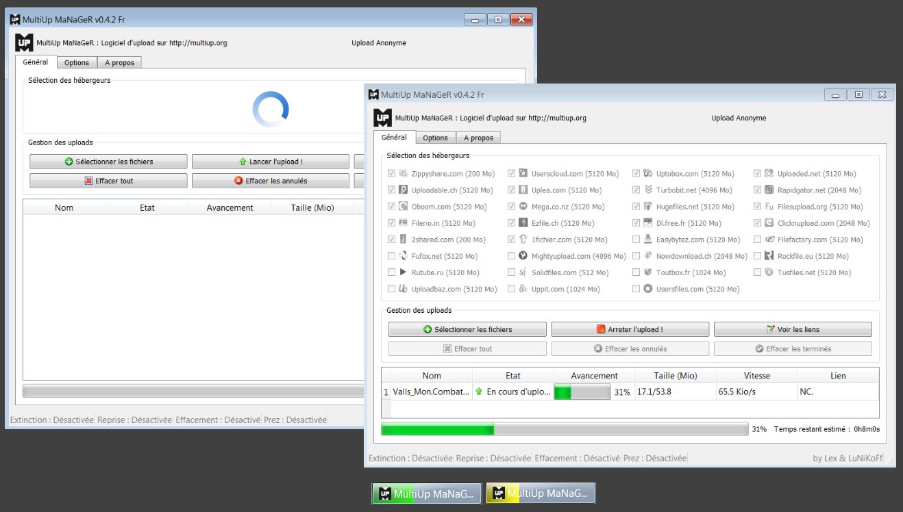

Multiup MaNaGeR is a software written in Qt/C++ that can send files to the multiupload website : [multiup.org](https://multiup.org/).

The operation is simple: You upload a file on our server, this one is uploaded automatically, 
on several hosting-file websites. At the end, you get a link like: 
<code>https://www.multiup.org/download/RANDOM_NUMBERS/FILE_NAME</code>,
where you will be able to see and download your file on various hosting-file websites.

# License

[GPLv3](./LICENSE).